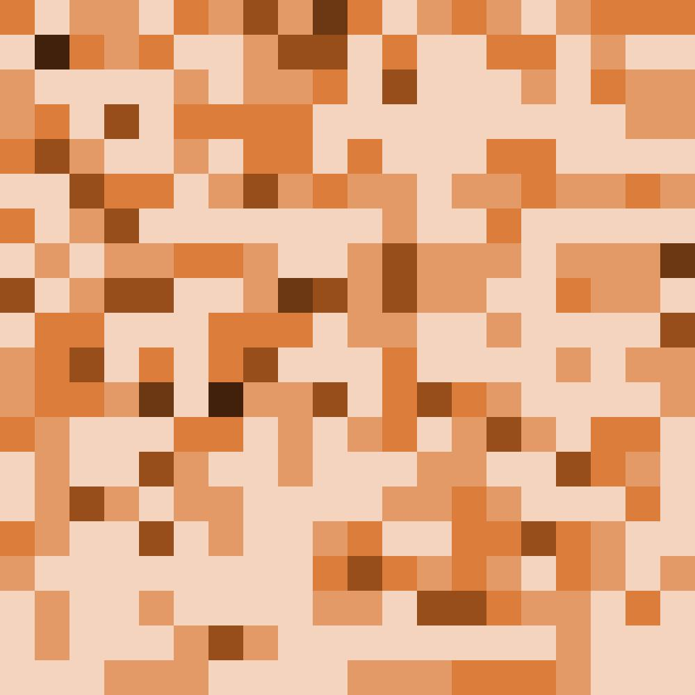
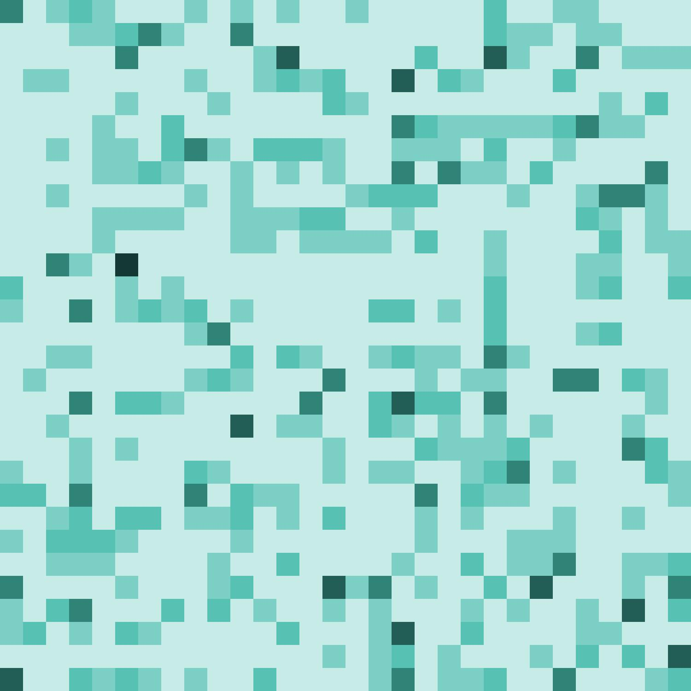

# re-design@hack4art-2019

Hack4art (2019) adlı sanat teknolojileri hackathonunda ReDesign ekibi olarak ikinci olduğumuz projenin kaynak kodlarıdır.

Hackathon Bilgisi:
- İsim: Hack4art
- Tarih: 25-26 Ekim 2019
- Düzenleyen: [İzmir Ege Üniversitesi](https://ege.edu.tr/eng-0/homepage.html), [EBİLTEM Teknoloji Transfer Ofisi](https://ebiltem.ege.edu.tr/), [Goethe Enstitüsü Kültür için Alan Fonu Desteği](https://kulturicinalan.com)
- İnternet Sitesi: [hack4art.com](https://web.archive.org/web/20200318214714/https://www.hack4art.com/)

# Gerekli Yazılımlar
- Python 3
    - pandas
    - pillow

# Kodlar Tarafından Üretilmiş Resimler
Genel | Genel RGB
------------ | -------------
 | 

Doktor       | Hasta Bakıcı  | Hemşire
------------ | ------------- | -------------
 |  | 

# Copyright
Copyright (c) 2019, ReDesign Team. All rights are reserved.
